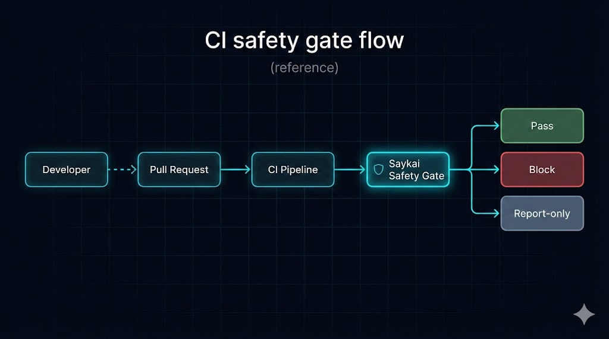

# saykai-examples

> Enterprise reference examples for deterministic CI safety enforcement in high-stakes and safety-critical systems.
>
> These materials illustrate how Saykai is evaluated, integrated, and reviewed in regulated and safety-critical environments.

This repository contains non-executable reference material that demonstrates how Saykai is used and what its outputs look like, without exposing production code or internal implementation details.

## What this repository is
- High-level, illustrative examples of Saykai inputs and outputs
- Sample “Safety Spec” formats with placeholder values
- Static examples of CI results (pass, block, report-only)
- Conceptual diagrams and walkthroughs focused on behavior, not mechanics

## What this repository is NOT
- Not a runnable implementation
- Not open-source Saykai code
- Not a GitHub Action, runner, or SDK
- Not guaranteed to reflect exact production schemas, flags, or defaults

Everything here is intentionally simplified and sanitized.

## Design principles

Saykai is built around a small set of non-negotiable principles.  
These examples reflect those principles at a conceptual level.

- Determinism first – identical inputs produce identical outcomes
- Fail closed – unsafe or ambiguous results block by default
- Behavior over tests – validate real scenarios, not just code paths
- Evidence over trust – every run produces auditable artifacts
- CI as the control plane – enforcement happens before deployment

## Repository structure

examples/
  safety-spec.example.yaml
  scenario-input.json
  sample-output-pass.txt
  sample-output-block.txt

artifacts/
  sample-safety-pack.json

diagrams/
  ci-safety-gate-flow.png

README.md  
SECURITY.md

All files are static and non-executable.

## Example workflow (conceptual)

1. A pull request is opened.
2. CI invokes Saykai with a safety specification and execution context.
3. Saykai evaluates behavior changes using scenarios and historical signals.
4. A deterministic result is produced:
   - Pass – no violations detected
   - Block – merge is prevented
   - Report-only – merge allowed, issues reported

No code in this repository executes this flow.  
The files illustrate what the workflow looks like, not how it is implemented.

## Example artifact: Safety Pack

Production Saykai runs emit structured evidence artifacts for every evaluation.  
The file below is a static, illustrative example.

artifacts/sample-safety-pack.json

This artifact demonstrates:
- A clear enforcement outcome
- Explicit violation reporting
- Machine-readable evidence suitable for review or audit

## What evaluators should look for

When reviewing these examples, focus on:
- How safety expectations are expressed declaratively
- How behavior changes are evaluated before deployment
- How results are explicit, reviewable, and deterministic
- How enforcement decisions are separated from implementation details

The goal is to make safety decisions observable, repeatable, and reviewable.

## Governance and review

In production environments, artifacts like these are typically:
- Reviewed directly in pull requests
- Attached to change records
- Retained for audit and incident analysis

Saykai is designed to support safety governance without slowing delivery.

## Security

If you believe you have found a security issue related to Saykai, please see SECURITY.md for reporting instructions.

## License

All contents in this repository are provided for reference purposes only.
