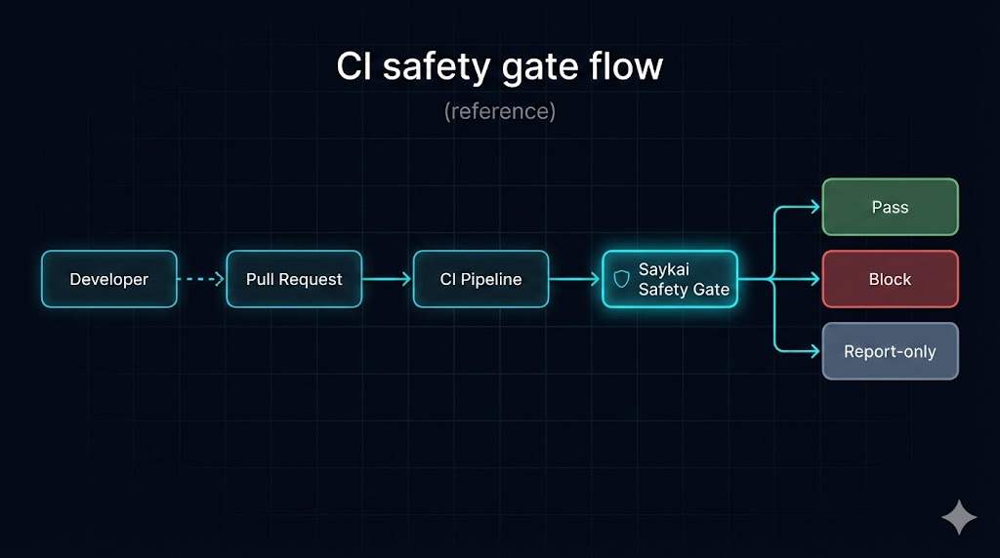

# saykai-examples

> Enterprise reference examples for deterministic CI safety enforcement of
> Nav2/ROS2 robot navigation configurations.
>
> These materials illustrate how Saykai evaluates robot config changes,
> what its findings look like, and what evidence it produces — without
> exposing production code or internal implementation details.

This repository contains non-executable reference material that
demonstrates how Saykai is used and what its outputs look like, without
exposing production code or internal implementation details.

## What this repository is

- High-level, illustrative examples of Saykai policy and Nav2 config inputs
- Sample findings output for a clean run and a blocked run
- A static example of the signed evidence artifact ("Safety Pack")
- A conceptual diagram of the CI enforcement flow

## What this repository is NOT

- Not a runnable implementation
- Not open-source Saykai code
- Not a GitHub Action, runner, or SDK — for the actual integration (a real,
  working `saykai.yml`/`saykai-policy.yml` you can copy into your own
  repo), see [`saykai-systems/saykai-action`'s `quickstart/`
  directory](https://github.com/saykai-systems/saykai-action/tree/main/quickstart)
- Not guaranteed to reflect exact production field names, flags, or
  defaults down to the byte — illustrative of shape and intent, not a
  schema contract

Everything here is intentionally simplified and sanitized: rule
identifiers, thresholds, trace IDs, hashes, and signatures below are all
fabricated for illustration.

## Design principles

Saykai is built around a small set of non-negotiable principles. These
examples reflect those principles at a conceptual level.

- Determinism first — identical inputs produce identical outcomes
- Fail closed — unsafe, missing, or ambiguous results block by default
- Policy as code — safety thresholds are a version-controlled file in
  *your* repo, reviewed like any other change, not a hidden setting
- Evidence over trust — every run produces a signed, auditable artifact
- CI as the control plane — enforcement happens before deployment, on
  every pull request

## Repository structure

```
examples/
  saykai-policy.example.yaml   # illustrative policy: thresholds + rules
  nav2_params.example.yaml     # illustrative Nav2 config being evaluated
  sample-output-pass.txt       # console output, a clean run
  sample-output-block.txt      # console output, a blocked run

artifacts/
  sample-safety-pack.json      # signed evidence artifact (illustrative)

diagrams/
  ci-safety-gate-flow.png

docs/
  evaluation-overview.md       # the three-room evaluation model

README.md
SECURITY.md
```

All files are static and non-executable.

## Example workflow (conceptual)

1. A pull request changes a robot's Nav2 configuration.
2. CI invokes Saykai against that config and a customer-approved policy.
3. Saykai evaluates the change: entropy/secret scanning, optional
   behavioral simulation, and structural policy checks against velocity,
   acceleration, and footprint-clearance thresholds.
4. A deterministic result is produced:
   - **Pass** — no violations detected
   - **Block** — merge is prevented
   - **Report-only** — merge allowed, issues reported



No code in this repository executes this flow. The files illustrate what
the workflow looks like, not how it is implemented.

## Example artifact: Safety Pack

Production Saykai runs emit a signed, structured evidence artifact for
every evaluation — a cryptographic seal (and, when a local signing key is
available, an Ed25519 signature) over the entire record, so a finding, a
timestamp, or an outcome can't be edited after the fact without detection.
The file below is a static, illustrative example — the trace ID, hashes,
and signature are fabricated.

`artifacts/sample-safety-pack.json`

This artifact demonstrates:

- A clear enforcement outcome tied to the exact policy file that produced it
- Explicit, per-finding violation reporting with rule IDs and math evidence
- A tamper-evident seal covering the whole record, not just the findings

## What evaluators should look for

When reviewing these examples, focus on:

- How safety expectations are expressed declaratively (`saykai-policy.yml`)
- How a Nav2 config change is evaluated against those thresholds before
  deployment
- How results are explicit, reviewable, and deterministic
- How enforcement decisions are separated from implementation details —
  and how the evidence artifact makes a decision independently verifiable
  after the fact

The goal is to make safety decisions observable, repeatable, and
reviewable.

## Governance and review

In production environments, artifacts like these are typically:

- Reviewed directly in pull requests, alongside the config change itself
- Attached to change records
- Retained for audit and incident analysis

Because the policy that governs enforcement is itself a version-controlled
file in your own repository, a change to a safety threshold goes through
the same review process as any other code change — it isn't a hidden
setting somewhere else.

## Security

If you believe you have found a security issue related to Saykai, please
see `SECURITY.md` for reporting instructions.

## License

All contents in this repository are provided for reference purposes only.
